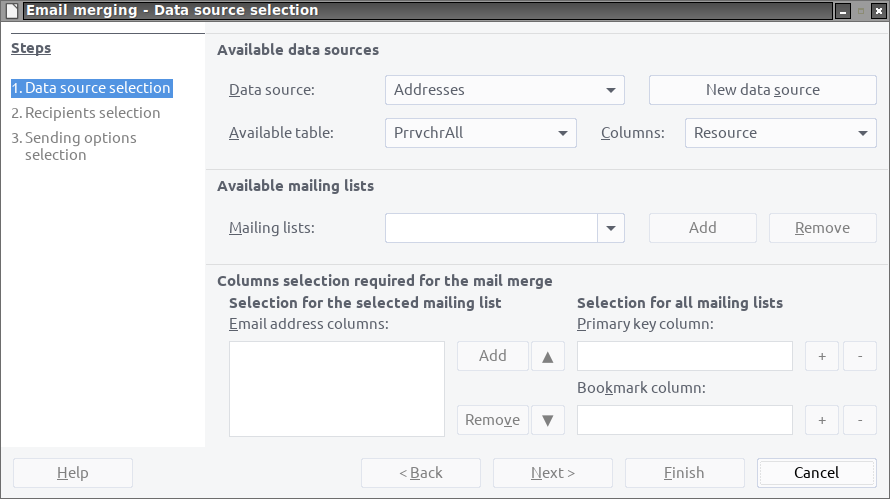
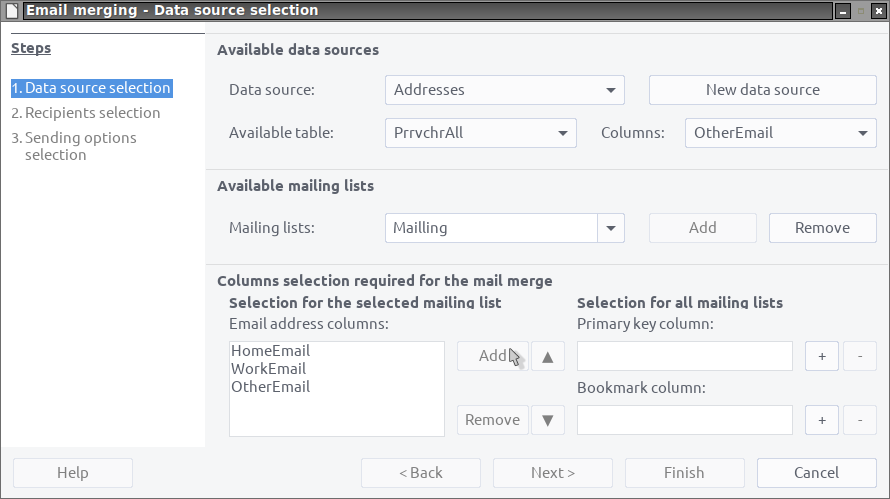

<!--
╔════════════════════════════════════════════════════════════════════════════════════╗
║                                                                                    ║
║   Copyright (c) 2020 https://prrvchr.github.io                                     ║
║                                                                                    ║
║   Permission is hereby granted, free of charge, to any person obtaining            ║
║   a copy of this software and associated documentation files (the "Software"),     ║
║   to deal in the Software without restriction, including without limitation        ║
║   the rights to use, copy, modify, merge, publish, distribute, sublicense,         ║
║   and/or sell copies of the Software, and to permit persons to whom the Software   ║
║   is furnished to do so, subject to the following conditions:                      ║
║                                                                                    ║
║   The above copyright notice and this permission notice shall be included in       ║
║   all copies or substantial portions of the Software.                              ║
║                                                                                    ║
║   THE SOFTWARE IS PROVIDED "AS IS", WITHOUT WARRANTY OF ANY KIND,                  ║
║   EXPRESS OR IMPLIED, INCLUDING BUT NOT LIMITED TO THE WARRANTIES                  ║
║   OF MERCHANTABILITY, FITNESS FOR A PARTICULAR PURPOSE AND NONINFRINGEMENT.        ║
║   IN NO EVENT SHALL THE AUTHORS OR COPYRIGHT HOLDERS BE LIABLE FOR ANY             ║
║   CLAIM, DAMAGES OR OTHER LIABILITY, WHETHER IN AN ACTION OF CONTRACT,             ║
║   TORT OR OTHERWISE, ARISING FROM, OUT OF OR IN CONNECTION WITH THE SOFTWARE       ║
║   OR THE USE OR OTHER DEALINGS IN THE SOFTWARE.                                    ║
║                                                                                    ║
╚════════════════════════════════════════════════════════════════════════════════════╝
-->
**Ce [document](https://prrvchr.github.io/smtpMailerOOo/README_fr) en français.**

**The use of this software subjects you to our** [**Terms Of Use**](https://prrvchr.github.io/smtpMailerOOo/smtpMailerOOo/registration/TermsOfUse_en) **and** [**Data Protection Policy**](https://prrvchr.github.io/smtpMailerOOo/smtpMailerOOo/registration/PrivacyPolicy_en)

# version [0.0.1](https://prrvchr.github.io/smtpMailerOOo#historical)

## Introduction:

**smtpMailerOOo** is part of a [Suite](https://prrvchr.github.io/) of [LibreOffice](https://fr.libreoffice.org/download/telecharger-libreoffice/) and/or [OpenOffice](https://www.openoffice.org/fr/Telecharger/) extensions allowing to offer you innovative services in these office suites.  
This extension allows you to send documents in LibreOffice / OpenOffice as an email, possibly by mail merge, to your telephone contacts.

Being free software I encourage you:
- To duplicate its [source code](https://github.com/prrvchr/smtpMailerOOo).
- To make changes, corrections, improvements.
- To open [issue](https://github.com/prrvchr/smtpMailerOOo/issues/new) if needed.

In short, to participate in the development of this extension.  
Because it is together that we can make Free Software smarter.

## Requirement:

smtpMailerOOo uses a local HsqlDB database of version 2.5.1.  
The use of HsqlDB requires the installation and configuration within LibreOffice / OpenOffice of a **JRE version 11 or after**.  
I recommend [AdoptOpenJDK](https://adoptopenjdk.net/) as your Java installation source.

If you are using **LibreOffice on Linux**, then you are subject to [bug 139538](https://bugs.documentfoundation.org/show_bug.cgi?id=139538).  
To work around the problem, please uninstall the packages:
- libreoffice-sdbc-hsqldb
- libhsqldb1.8.0-java

If you still want to use the Embedded HsqlDB functionality provided by LibreOffice, then install the [HsqlDBembeddedOOo](https://prrvchr.github.io/HsqlDBembeddedOOo/) extension.  
OpenOffice and LibreOffice on Windows are not subject to this malfunction.

## Installation:

It seems important that the file was not renamed when it was downloaded.
If necessary, rename it before installing it.

- Install [OAuth2OOo.oxt](https://github.com/prrvchr/OAuth2OOo/raw/master/OAuth2OOo.oxt) extension version 0.0.5.

You must first install this extension, if it is not already installed.

- Install [HsqlDBDriverOOo.oxt](https://github.com/prrvchr/HsqlDBDriverOOo/raw/master/HsqlDBDriverOOo.oxt) extension version 0.0.4.

This extension is necessary to use HsqlDB version 2.5.1 with all its features.

- Install [gContactOOo.oxt](https://github.com/prrvchr/gContactOOo/raw/master/gContactOOo.oxt) extension version 0.0.6.

This extension is only needed if you want to use your personal phone contacts (Android contact) as a data source for mailing lists and document merging.

- Install [smtpMailerOOo.oxt](https://github.com/prrvchr/smtpMailerOOo/raw/main/smtpMailerOOo.oxt) extension version 0.0.1.

Restart LibreOffice / OpenOffice after installation.

## Use:

### Introduction:

To be able to use the email merge feature using mailing lists, it is necessary to have a datasource with tables having the following columns:
- One or more columns of email addresses. These columns will be selected from a list and if this selection is not unique, then the first non-null email address will be used.
- A primary key column to uniquely identify records. This column must be of type SQL VARCHAR.
- A row number column or ROWNUM which corresponds to the row number in the result set of an SQL command.

In addition, this datasource must have at least one **main table**, including all the records that can be used during the email merge.

If you do not have such a datasource then I invite you to install the [gContactOOo](https://github.com/prrvchr/gContactOOo/raw/master/gContactOOo.oxt) extension.
This extension will allow you to use your Android phone (your phone contacts) as a datasource.

### Merging emails to mailing lists:

#### Requirement:

To be able to post emails to a mailing list, you must:
- Have a data source as described in the previous introduction.
- Open a Writer document in LibreOffice / OpenOffice.

This Writer document can include merge fields (insertable by the command: **Insert -> Field -> More fields -> Database -> Mail merge fields**), this is even necessary if you want to be able to customize the content of the email.  
These merge fields should only reference the **main table** of the data source.

#### Merging

In LibreOffice / OpenOffice Writer document go to: **Tools -> Add-Ons -> Sending emails -> Merge a document**

The datasource load for the **Email merging** wizard should appear: 

The following screenshots use the [gContactOOo](https://github.com/prrvchr/gContactOOo/raw/master/gContactOOo.oxt) extension as the data source. If you are using your own data source, it is necessary to adapt the settings in relation to it.

## Historical:

What remains to be done:

- Rewriting of mailmerge.py (to be compatible with: SSL and StartTLS, OAuth2 authentication... ie: with Mozilla IspBD technology)
- Write an Wizard using Mozilla IspDB technology able to find the correct configuration working with mailmerge.py.
- Writing of a UNO Service, running in the background (Python Thread), allowing to send e-mails.
