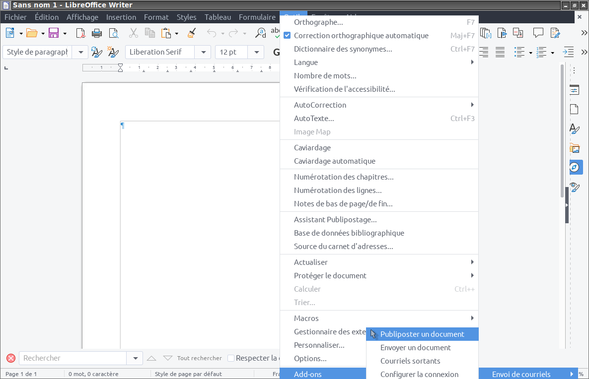

<!--
╔════════════════════════════════════════════════════════════════════════════════════╗
║                                                                                    ║
║   Copyright (c) 2020 https://prrvchr.github.io                                     ║
║                                                                                    ║
║   Permission is hereby granted, free of charge, to any person obtaining            ║
║   a copy of this software and associated documentation files (the "Software"),     ║
║   to deal in the Software without restriction, including without limitation        ║
║   the rights to use, copy, modify, merge, publish, distribute, sublicense,         ║
║   and/or sell copies of the Software, and to permit persons to whom the Software   ║
║   is furnished to do so, subject to the following conditions:                      ║
║                                                                                    ║
║   The above copyright notice and this permission notice shall be included in       ║
║   all copies or substantial portions of the Software.                              ║
║                                                                                    ║
║   THE SOFTWARE IS PROVIDED "AS IS", WITHOUT WARRANTY OF ANY KIND,                  ║
║   EXPRESS OR IMPLIED, INCLUDING BUT NOT LIMITED TO THE WARRANTIES                  ║
║   OF MERCHANTABILITY, FITNESS FOR A PARTICULAR PURPOSE AND NONINFRINGEMENT.        ║
║   IN NO EVENT SHALL THE AUTHORS OR COPYRIGHT HOLDERS BE LIABLE FOR ANY             ║
║   CLAIM, DAMAGES OR OTHER LIABILITY, WHETHER IN AN ACTION OF CONTRACT,             ║
║   TORT OR OTHERWISE, ARISING FROM, OUT OF OR IN CONNECTION WITH THE SOFTWARE       ║
║   OR THE USE OR OTHER DEALINGS IN THE SOFTWARE.                                    ║
║                                                                                    ║
╚════════════════════════════════════════════════════════════════════════════════════╝
-->
**This [document](https://prrvchr.github.io/smtpMailerOOo) in English.**

**L'utilisation de ce logiciel vous soumet à nos** [**Conditions d'utilisation**](https://prrvchr.github.io/smtpMailerOOo/smtpMailerOOo/registration/TermsOfUse_fr) **et à notre** [**Politique de protection des données**](https://prrvchr.github.io/smtpMailerOOo/smtpMailerOOo/registration/PrivacyPolicy_fr)

# version [0.0.1](https://prrvchr.github.io/smtpMailerOOo/README_fr#historique)

## Introduction:

**smtpMailerOOo** fait partie d'une [Suite](https://prrvchr.github.io/README_fr) d'extensions [LibreOffice](https://fr.libreoffice.org/download/telecharger-libreoffice/) et/ou [OpenOffice](https://www.openoffice.org/fr/Telecharger/) permettant de vous offrir des services inovants dans ces suites bureautique.  
Cette extension vous permet d'envoyer du courrier électronique dans LibreOffice / OpenOffice, par un nouveau client smtp qui agit comme un serveur.

Etant un logiciel libre je vous encourage:
- A dupliquer son [code source](https://github.com/prrvchr/smtpMailerOOo).
- A apporter des modifications, des corrections, des ameliorations.
- D'ouvrir un [dysfonctionnement](https://github.com/prrvchr/smtpMailerOOo/issues/new) si nécessaire.

Bref, à participer au developpement de cette extension.
Car c'est ensemble que nous pouvons rendre le Logiciel Libre plus intelligent.

## Prérequis:

smtpMailerOOo utilise une base de données locale HsqlDB version 2.5.1.  
L'utilisation de HsqlDB nécessite l'installation et la configuration dans LibreOffice / OpenOffice d'un **JRE 11 ou version ultérieure**.  
Je vous recommande [AdoptOpenJDK](https://adoptopenjdk.net/) comme source d'installation de Java.

Si vous utilisez **LibreOffice sous Linux**, alors vous êtes sujet au [dysfonctionnement 139538](https://bugs.documentfoundation.org/show_bug.cgi?id=139538).  
Pour contourner le problème, veuillez désinstaller les paquets:
- libreoffice-sdbc-hsqldb
- libhsqldb1.8.0-java

Si vous souhaitez quand même utiliser la fonctionnalité HsqlDB intégré fournie par LibreOffice, alors installez l'extension [HsqlDBembeddedOOo](https://prrvchr.github.io/HsqlDBembeddedOOo/README_fr).  
OpenOffice et LibreOffice sous Windows ne sont pas soumis à ce dysfonctionnement.

## Installation:

Il semble important que le fichier n'ait pas été renommé lors de son téléchargement.  
Si nécessaire, renommez-le avant de l'installer.

- Installer l'extension [OAuth2OOo.oxt](https://github.com/prrvchr/OAuth2OOo/raw/master/OAuth2OOo.oxt) version 0.0.5.

Vous devez d'abord installer cette extension, si elle n'est pas déjà installée.

- Installer l'extension [HsqlDBDriverOOo.oxt](https://github.com/prrvchr/HsqlDBDriverOOo/raw/master/HsqlDBDriverOOo.oxt) version 0.0.4.

Cette extension est nécessaire pour utiliser HsqlDB version 2.5.1 avec toutes ses fonctionnalités.

- Installer l'extension [gContactOOo.oxt](https://github.com/prrvchr/gContactOOo/raw/master/gContactOOo.oxt) version 0.0.6.

Cette extension n'est nécessaire que si vous souhaitez utiliser vos contacts téléphoniques personnels (contact Android) comme source de données pour les listes de diffusion et la fusion de documents.

- Installer l'extension [smtpMailerOOo.oxt](https://github.com/prrvchr/smtpMailerOOo/raw/main/smtpMailerOOo.oxt) version 0.0.1.

Redémarrez LibreOffice / OpenOffice après l'installation.

## Utilisation:

### Introduction:

Pour pouvoir utiliser la fonctionnalité de publipostage d'emails en utilisant des listes de diffusion, il est nécessaire d'avoir une source de données avec des tables ayant les colonnes suivantes:
- Une ou plusieurs colonnes d'adresses électroniques. Ces colonnes seront sélectionnées dans une liste et si cette sélection n'est pas unique, alors la première adresse courriel non nulle sera utilisée.
- Une colonne de clé primaire pour identifier de manière unique les enregistrements. Cette colonne doit être de type SQL VARCHAR.
- Une colonne de numéro de ligne ou ROWNUM qui correspond au numéro de ligne dans le jeu de résultats d'une commande SQL.
De plus, cette source de données doit avoir au moins une **table principale**, comprenant tous les enregistrements pouvant être utilisés lors du publipostage du courriel.

Si vous ne disposez pas d'une telle source de données alors je vous invite à installer l'extension [gContactOOo](https://github.com/prrvchr/gContactOOo/raw/master/gContactOOo.oxt).
Cette extension vous permettra d'utiliser votre téléphone Android (vos contacts téléphoniques) comme source de données.

### Publipostage de courriels à des listes de diffusion:

Pour pouvoir publiposter des courriels suivant une liste de diffusion, vous devez d'abord ouvrir un document Writer dans LibreOffice / OpenOffice.  
Ce document Writer peut inclure des champs de fusion (insérables par la commande: Insertion -> Champ -> Autres champs -> Base de données -> Champ de publipostage), cela est même nécessaire si vous souhaitez pouvoir personnaliser le contenu du courriel.  
Ses champs de fusion doivent uniquement faire référence à la **table principale** de la source de données.

Dans un document LibreOffice / OpenOffice Writer aller à: Outils -> Add-ons -> Envoi de courriels -> Publiposter un document

## Historique:

**Ce qui reste à faire:**

- Réécriture de mailmerge.py (pour être compatible avec: SSL, StartTLS et authentification OAuth2 ... c'est à dire: avec la technologie Mozilla IspBD).
- Ecrire un assistant à l'aide de la technologie Mozilla IspDB capable de trouver la configuration correcte fonctionnant avec mailmerge.py.
- Ecriture d'un Service UNO, tournant en tâche de fond (Python Thread), permettant d'envoyer du courrier électronique.
